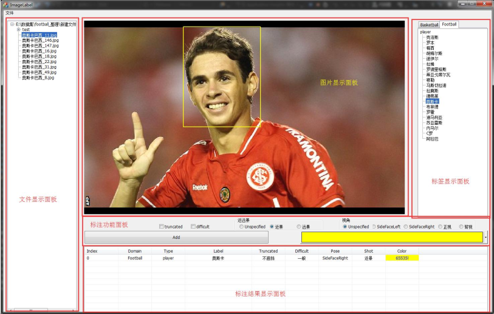

# Image Label Tool--Prepare your own dataset!
* Developed by C++/MFC(VS2013) and it can be used to prepare for object detection and image classification tasks.  ++
* Now it only has Chinese version.  
* It support VOC xml label file convert.

